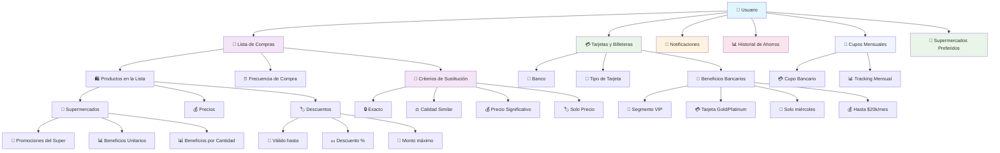

# SABU - Boilerplate MVP

## 🎯 Objetivo
Construir tu idea de negocio como MVP funcional para presentar a inversores.

## 📊 Estructura de Base de Datos



## 🚀 Setup Rápido

**¿Primera vez?** Sigue la guía completa en [SETUP.md](SETUP.md)

```bash
# 1. Clonar y instalar
git clone <tu-repo-url>
cd SABU

# 2. Frontend
cd frontend && npm install

# 3. Backend  
cd ../backend && npm install

# 4. Ejecutar
# Terminal 1: cd frontend && npm run dev
# Terminal 2: cd backend && npm run dev
```

## 📱 URLs
- **Frontend**: http://localhost:3000
- **Backend**: http://localhost:4000
- **Health Check**: http://localhost:4000/api/health

## 🛠️ Stack
- **Frontend**: React + Vite + Tailwind CSS
- **Backend**: Node.js + Express
- **Database**: Supabase (PostgreSQL)
- **Auth**: Magic Link (email sin contraseña)
- **Deploy**: Vercel + Render (100% GRATIS)

## 📚 Documentación
- **Setup Completo**: [SETUP.md](SETUP.md) - Guía paso a paso
- **Business Context**: [business-context.md](business-context.md) - Idea de negocio
- **Requirements**: [requirements.md](requirements.md) - Problemas core del MVP
- **Modelo Final**: [MODELO_FINAL.md](MODELO_FINAL.md) - Estructura de base de datos
- **Criterios de Sustitución**: [CRITERIOS_SUSTITUCION.md](CRITERIOS_SUSTITUCION.md) - Flexibilidad por producto
- **Beneficios Híbridos**: [BENEFICIOS_HIBRIDOS.md](BENEFICIOS_HIBRIDOS.md) - Descuentos bancarios + supermercado