# SABU - Boilerplate MVP

## 🎯 Objetivo
Construir tu idea de negocio como MVP funcional para presentar a inversores.

## 📊 Estructura de Base de Datos

```mermaid
graph TD
    A[👤 Usuario] --> B[🛒 Lista de Compras]
    A --> C[💳 Tarjetas y Billeteras]
    A --> D[📱 Notificaciones]
    A --> E[📊 Historial de Ahorros]
    
    B --> F[🛍️ Productos en la Lista]
    B --> G[⏰ Frecuencia de Compra]
    
    F --> H[🏪 Supermercados]
    F --> I[💰 Precios]
    F --> J[🏷️ Descuentos]
    
    H --> K[📍 Sucursales Cercanas]
    H --> L[🎯 Promociones del Super]
    
    C --> M[🏦 Banco]
    C --> N[💎 Tipo de Tarjeta]
    C --> O[🎁 Beneficios Bancarios]
    
    J --> P[📅 Válido hasta]
    J --> Q[💵 Descuento %]
    J --> R[🔢 Monto máximo]
    
    O --> S[👥 Segmento VIP]
    O --> T[💳 Tarjeta Gold/Platinum]
    
    style A fill:#e1f5fe
    style B fill:#f3e5f5
    style C fill:#e8f5e8
    style D fill:#fff3e0
    style E fill:#fce4ec
```



## 🚀 Setup Rápido

### 1. Clonar y instalar
```bash
git clone <tu-repo-url>
cd SABU

# Frontend
cd frontend
npm install

# Backend
cd backend
npm install
```

### 2. Ejecutar en desarrollo
```bash
# Terminal 1 - Frontend
cd frontend
npm run dev
# → http://localhost:3000

# Terminal 2 - Backend
cd backend
npm run dev
# → http://localhost:4000
```

## 📱 URLs
- **Frontend**: http://localhost:3000
- **Backend**: http://localhost:4000
- **Health Check**: http://localhost:4000/api/health

## 📋 Próximos Pasos
1. Configurar Supabase
2. Agregar tu idea de negocio
3. Crear interfaz mobile
4. Deploy a producción
5. Pitch a inversores

## 🛠️ Stack
- **Frontend**: React + Vite
- **Backend**: Node.js + Express
- **Database**: Supabase
- **Deploy**: Vercel + Render (100% GRATIS)

## 📚 Documentación
- **Business Context**: `business-context.md`
- **Requirements**: `requirements.md`
- **Database Structure**: `database-structure.md`
- **Deployment Guide**: `DEPLOYMENT.md`